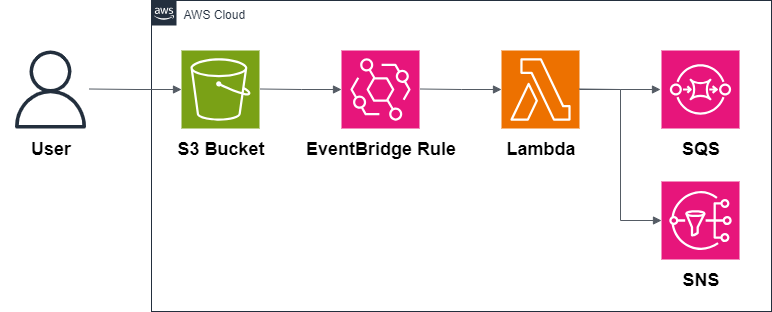
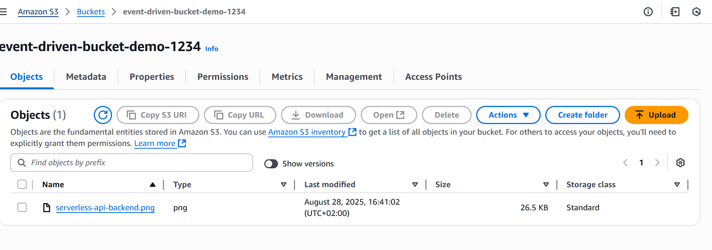
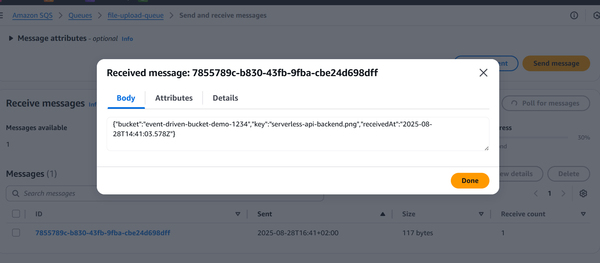
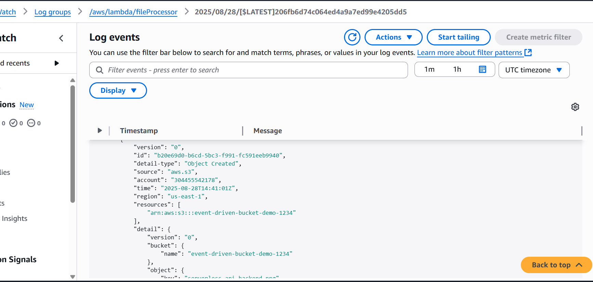
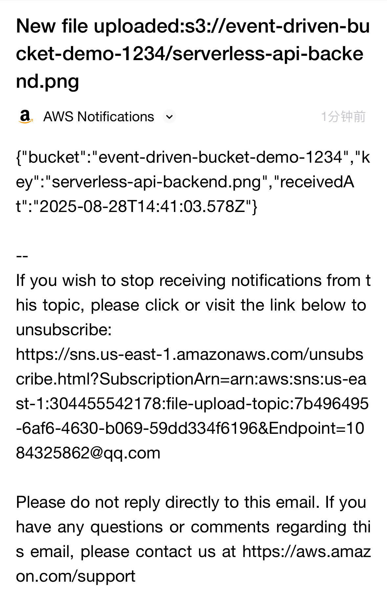

## 🧭 Repository Context

This repository is part of a modularization effort to separate each of the **8 most common AWS architectures** into independent projects.  
The code and resources here were **extracted from a general repository** that originally contained all 8 architectures, to improve clarity, maintainability, and reuse.

🔗 [Original Repository – AWS Architectures Collection](https://github.com/hongzz0618/aws-architecture-collection)

---

## 🔁 AWS Event-Driven Processing

This project demonstrates how to build an **event-driven architecture** on AWS.  
It uses **Amazon S3**, **Amazon EventBridge**, **AWS Lambda**, **Amazon SNS**, and **Amazon SQS** to process events asynchronously and deliver notifications.

---

## 📐 Architecture

### Main Services
- **S3** → Stores uploaded files that trigger events.
- **EventBridge** → Routes S3 events to downstream services.
- **Lambda** → Processes the file and publishes notifications.
- **SNS** → Sends notifications to subscribers (email, SMS, HTTP, etc.).
- **SQS** → Stores events for asynchronous processing or retries.

---

## ✅ Why This Pattern?

| Feature       | Benefit                                      |
|--------------|----------------------------------------------|
| **Asynchronous** | Decouples ingestion from processing |
| **Scalable**      | Handles high volumes of events       |
| **Reliable**      | Ensures messages are not lost (SQS) |
| **Extensible**    | Add new consumers without changing producers |

---

## 🌍 Real-World Use Cases
- File upload triggers for processing
- Automated workflows and notifications
- Decoupled microservices communication
- Retry and dead-letter handling for reliability

---

## 📦 What’s Inside
- Architecture diagram
- Terraform code for S3, EventBridge, Lambda, SNS, and SQS
- Example Node.js Lambda for file processing
- Deployment scripts

---

## Demo Screenshots

Here are a couple of screenshots showing the deployed event driven:

  

